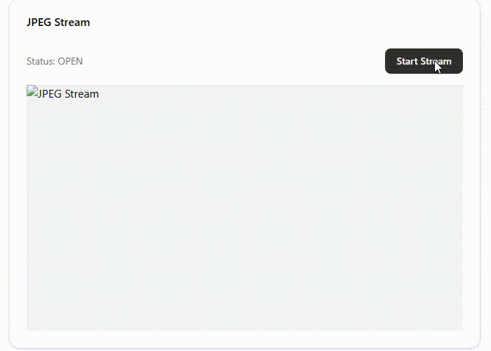
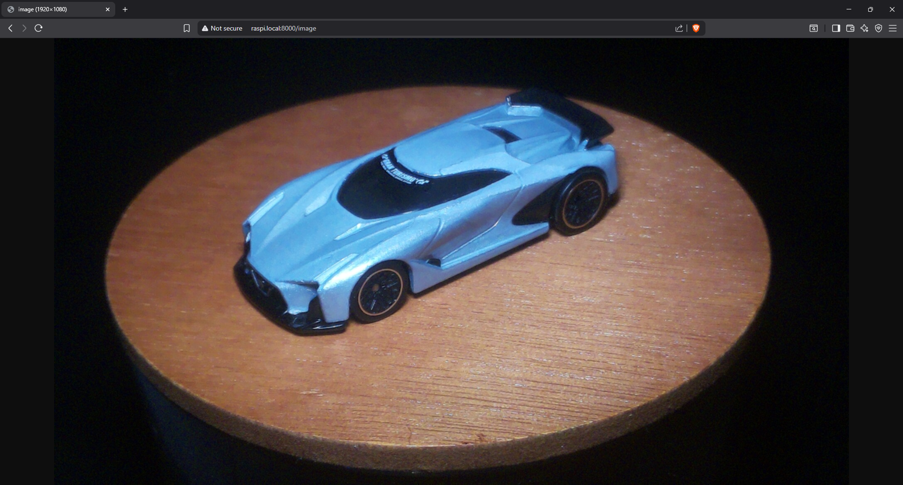

# Real-Time Object Detection System on Raspberry Pi

## Table of Contents
1.  [Project Overview](#1-project-overview)
2.  [Project Goals & Deliverables](#2-project-goals--deliverables)
3.  [Hardware Requirements](#3-hardware-requirements)
4.  [Software Requirements](#4-software-requirements)
5.  [Setup Guide](#5-setup-guide)
    * [5.1. Initial Raspberry Pi OS Setup](#51-initial-raspberry-pi-os-setup)
    * [5.2. Connect Hardware](#52-connect-hardware)
    * [5.3. Raspberry Pi OS Configuration](#53-raspberry-pi-os-configuration)
    * [5.4. Install Python Environment and Dependencies](#54-install-python-environment-and-dependencies)
6.  [Project Structure](#6-project-structure)
7.  [How to Run Demonstration Scripts](#7-how-to-run-demonstration-scripts)
    * [7.1. Week 2: Camera Access & Streaming](#71-week-2-camera-access--streaming)
    * [7.2. Week 3: Image Preprocessing & ML Toolchain Check](#72-week-3-image-preprocessing--ml-toolchain-check)
8.  [Next Steps & Future Work](#8-next-steps--future-work)
9.  [Troubleshooting Common Issues](#9-troubleshooting-common-issues)
10. [Acknowledgements](#10-acknowledgements)

## 1. Project Overview

This project aims to develop a real-time object detection and tracking system leveraging the computational capabilities of a **Raspberry Pi** coupled with a camera module. The focus is on implementing an **edge computing** solution, where machine learning inference occurs directly on the device, minimizing reliance on cloud processing for immediate feedback.

The system is designed to provide a foundational framework for real-time computer vision tasks on resource-constrained embedded platforms, offering a balance between performance and efficiency.

## 2. Project Goals & Deliverables

By the end of the 8-week project period, the goal is to deliver a functional prototype demonstrating the following capabilities:

* **Core Object Detection:** Reliably detect **one specific object class** (e.g., a blue square, a toy car) in real-time using a lightweight TensorFlow Lite model.
* **Basic Object Tracking:** Display bounding boxes and approximate coordinates for the detected object, potentially with a simple object count.
* **Real-time Performance:** Achieve a minimum of 5-10 frames per second (FPS) for detection on the Raspberry Pi.
* **Edge Computing Demonstration:** All image processing and ML inference will be performed locally on the Raspberry Pi.
* **Output & Interaction:** Display detection results on an HDMI monitor or via a simple web interface.
* **Codebase:** A well-structured, documented, and reproducible Python codebase on GitHub.
* **Project Report:** A concise report detailing architecture, challenges, design choices, and learning outcomes.

## 3. Hardware Requirements

* **Raspberry Pi:** Raspberry Pi 3 Model B+ or Raspberry Pi 4 Model B (Raspberry Pi 4 recommended for better performance).
* **Camera Module:** Raspberry Pi Camera Module V2 (or any compatible CSI camera module).
* **MicroSD Card:** Minimum 16GB, Class 10 or higher.
* **Power Supply:** Raspberry Pi compatible power supply (e.g., USB-C for Pi 4).
* **Peripherals (for initial setup/display):** HDMI monitor, USB Keyboard, USB Mouse.
* **Network:** Ethernet cable (optional) or Wi-Fi connectivity.

## 4. Software Requirements

* **Operating System:** Raspberry Pi OS (64-bit recommended, either Desktop or Lite version).
* **SSH Client:** (e.g., PuTTY for Windows, built-in terminal for Linux/macOS) for headless access.
* **Git:** For cloning this repository.
* **Python:** Python 3.x.
* **Python Libraries:**
    * `numpy`
    * `opencv-python` (or `opencv-python-headless` for no GUI display on Pi itself)
    * `picamera2`
    * `Flask` (for web streaming functionality)
    * `tflite-runtime` (specifically optimized for Raspberry Pi)

## 5. Setup Guide

This section provides a summary of the setup process. For more detailed instructions, refer to `docs/setup_guide.md`.

### 5.1. Initial Raspberry Pi OS Setup

1.  **Download & Flash OS:** Use Raspberry Pi Imager to flash the latest Raspberry Pi OS (64-bit recommended) onto your MicroSD card.
2.  **Headless Configuration (Recommended):** Before writing, use the gear icon (settings) in Raspberry Pi Imager to enable SSH, set a username/password, and configure Wi-Fi for easier headless setup.

### 5.2. Connect Hardware

1.  Insert the flashed MicroSD card into your Raspberry Pi.
2.  Connect the Camera Module ribbon cable to the CSI port on the Raspberry Pi, ensuring the silver contacts face the correct way (refer to Pi documentation for your model). Secure the clip.
3.  Connect any peripherals (monitor, keyboard, mouse) if not running headless.
4.  Connect the power supply to boot the Raspberry Pi.

### 5.3. Raspberry Pi OS Configuration

1.  **Enable Camera Interface:** Open a terminal (on Pi or via SSH) and run `sudo raspi-config`. Navigate to `3 Interface Options` > `P1 Camera` > `Yes`. Reboot if prompted.
2.  **Update OS:**
    ```bash
    sudo apt update
    sudo apt full-upgrade -y
    sudo reboot
    ```

### 5.4. Install Python Environment and Dependencies

1.  **Clone Repository:**
    ```bash
    cd ~
    git clone [https://github.com/djkonrad/rpi-object-tracker.git](https://github.com/djkonrad/rpi-object-tracker.git) # Replace with your actual repo URL
    cd rpi-object-tracker
    ```
2.  **Create Python Virtual Environment:**
    ```bash
    python3 -m venv venv
    source venv/bin/activate
    ```
3.  **Install Python Libraries:**
    ```bash
    pip install -r requirements.txt
    ```
    **Special Note for `tflite-runtime`:**
    The `tflite-runtime` package needs to be specifically downloaded for your Raspberry Pi's architecture and Python version (e.g., `armv7l` for 32-bit, `aarch64` for 64-bit).
    * Visit the [TensorFlow Lite Python Quickstart](https://www.tensorflow.org/lite/guide/python) page.
    * Find the pre-built `.whl` file that matches your Python version and Raspberry Pi OS (e.g., `bullseye`, `bookworm`).
    * Download it directly to your Pi (e.g., using `wget`).
    * Install it using `pip install <downloaded_file_name.whl>`.

## 6. Project Structure

````

rpi-object-tracker/
├── src/                          \# Contains all Python scripts for the project logic
│   ├── live\_camera\_feed.py       \# Live camera display on Pi's monitor
│   ├── headless\_camera\_stream.py \# Web-based camera stream for headless access
│   ├── capture\_sequence.py       \# Captures still images and video
│   ├── image\_preprocessing\_pipeline.py \# Demonstrates image resizing & color conversion
|   ├── single\_frame\_inference.py \# Demonstrates mobilenet model working on a single image
├── docs/                         \# Documentation files and images
│   ├── setup\_guide.md            \# Detailed setup instructions
│   ├── live\_stream.gif
│   └── single\_image.png
├── models/                       \# Directory for TensorFlow Lite (.tflite) models
│   └── mobilenet_model.tflite        \# Tested ML models
├── requirements.txt              \# Python project dependencies
└── README.md                     \# This README file

````

## 7. How to Run Demonstration Scripts

Ensure your Python virtual environment is activated before running any scripts:
`source venv/bin/activate`

### Camera Access & Streaming

These scripts demonstrate basic camera functionality and streaming.

* **Live Camera Feed (`live_camera_feed.py`)**
    * **Purpose:** Displays a real-time camera feed in a window on the Raspberry Pi's connected monitor.
    * **Requirements:** Raspberry Pi OS Desktop environment, monitor, keyboard, mouse.
    * **Run Command:**
        ```bash
        python src/live_camera_feed.py
        ```
    * **Exit:** Press `q` in the display window.

* **Headless Camera Stream (`headless_camera_stream.py`)**
    * **Purpose:** Streams the camera feed to a web browser via a Flask server, ideal for headless operation.
    * **Requirements:** `Flask` installed (`pip install Flask`), network access.
    * **Run Command:**
        ```bash
        python src/headless_camera_stream.py
        ```
    * **Access:** Open a web browser on another device on the same network and navigate to `http://<Your_Raspberry_Pi_IP_Address>:5000`.
    * **Example Output:**
        
    * **Exit:** Press `Ctrl+C` in the terminal where the script is running.

* **Capture Sequence (`capture_sequence.py`)**
    * **Purpose:** Captures a sequence of still images and a short video to the `captured_media/` directory.
    * **Run Command:**
        ```bash
        python src/capture_sequence.py
        ```
    * **Output:** Check the `captured_media/` directory for `still_image_*.jpg` and `test_video.mp4`.

### Image Preprocessing & ML Toolchain Check

These scripts prepare the environment for Machine Learning integration.

* **Image Preprocessing Pipeline (`single_frame_inference.py`)**
    * **Purpose:** Displays a live camera feed alongside a preprocessed version (resized to 1920X1080, color-converted) to simulate ML model input.
    * **Requirements:** Raspberry Pi OS Desktop environment, monitor, keyboard, mouse.
    * **Run Command:**
        ```bash
        python src/image_preprocessing_pipeline.py
        ```
    * **Example Output:**
        
    * **Exit:** Press `q` in either display window.


## 8. Next Steps & Future Work

* **!** Integrate a specific pre-trained lightweight object detection model (`.tflite` format) into the live camera stream and perform initial inference.
* **!** Implement core detection logic to extract bounding boxes and labels, and begin optimizing for real-time performance.
* **!** Develop object tracking, refine output display, and thoroughly test the system.

---